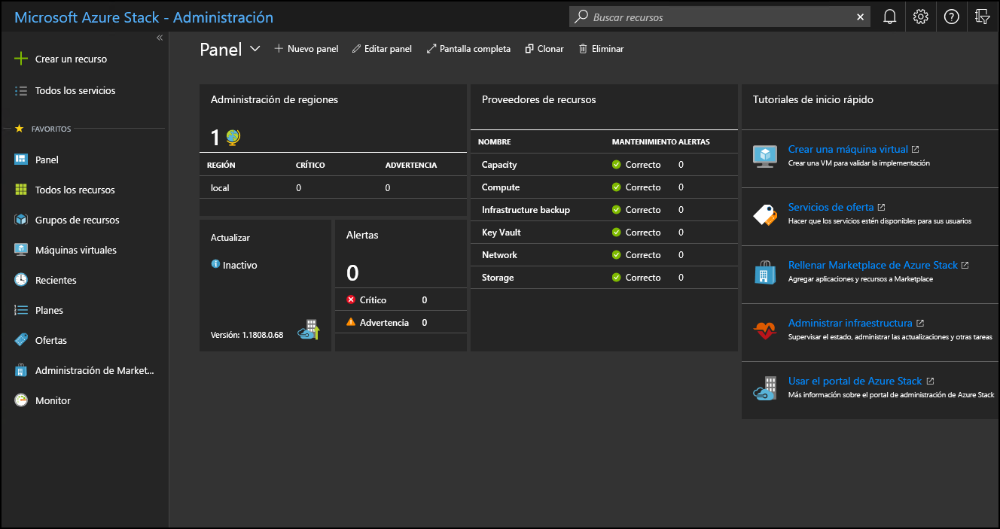

# Uso del portal de administración de Azure Stack Hub

Existen dos portales en Azure Stack Hub: el portal de administración y el portal de usuarios. Como operador de Azure Stack Hub, puede usar el portal de administración para realizar la administración y las operaciones diarias de Azure Stack Hub.

## Acceso al portal de administración

Para obtener acceso al portal de administración, vaya a la dirección URL del mismo e inicie sesión con las credenciales de un operador de Azure Stack Hub. En un sistema integrado, la dirección URL del portal varía según el nombre de la región y el nombre de dominio completo (FQDN) externo de la implementación de Azure Stack Hub. La dirección URL del portal de administración es siempre la misma para las implementaciones del Kit de desarrollo de Azure Stack (ASDK).

| Entorno | Dirección URL del portal de administración |   
| -- | -- | 
| ASDK| https://adminportal.local.azurestack.external  |
| Sistemas integrados | https://adminportal.&lt;*región*&gt;.&lt;*FQDN*&gt; | 
| | |

> [!TIP]
> En un entorno de ASDK, primero deberá asegurarse de que puede [conectarse al host del kit de desarrollo](../asdk/asdk-connect.md) mediante Conexión a Escritorio remoto o una red privada virtual (VPN).

 

La zona horaria predeterminada para todas las implementaciones de Azure Stack Hub se establece conforme a la hora universal coordinada (UTC).

En el portal de administración, puede hacer lo siguiente:

* [Registro de Azure Stack Hub en Azure](azure-stack-registration.md)
* [Rellenado de Marketplace](azure-stack-download-azure-marketplace-item.md)
* [Creación de planes, ofertas y suscripciones para los usuarios](service-plan-offer-subscription-overview.md)
* [Supervisión de estado y alertas](azure-stack-monitor-health.md)
* [Administración de actualizaciones de Azure Stack Hub](azure-stack-updates.md)

El icono del **tutorial de inicio rápido** proporciona vínculos a documentación en línea para las tareas más comunes.

Aunque un operador puede crear recursos como máquinas virtuales, redes virtuales y cuentas de almacenamiento en el portal de administración, debe [iniciar sesión en el portal de usuarios](../user/azure-stack-use-portal.md) para crear y probar esos recursos.

>[!NOTE]
>El vínculo **Crear una máquina virtual** del icono del tutorial de inicio rápido le permite crear una máquina virtual en el portal de administración, pero su única función es comprobar que Azure Stack Hub se haya implementado correctamente.

## Información acerca del comportamiento de una suscripción

Existen tres suscripciones creadas de manera predeterminada en el portal de administración: consumo, proveedor predeterminado y medición. Como operador, principalmente usará la *suscripción del proveedor predeterminada*. No se pueden agregar otras suscripciones y usarlas en el portal de administración.

Los usuarios crean otras suscripciones en el portal de usuarios en función de los planes y ofertas que se creen para ellos. Sin embargo, el portal de usuarios no proporciona acceso a ninguna de las funcionalidades administrativas u operativas del portal de administración.

Los portales de administración y de usuarios se apoyan en instancias independientes de Azure Resource Manager. Debido a la separación de Azure Resource Manager, las suscripciones no se intercambian de un portal a otro. Por ejemplo, si, como operador de Azure Stack Hub, inicia sesión en el portal de usuarios, no puede acceder a la *suscripción de proveedor predeterminada*. Aunque no tiene acceso a las funciones administrativas, puede crear suscripciones para usted mismo a partir de ofertas públicas disponibles. Siempre que haya iniciado sesión en el portal de usuarios, se le considerará un usuario inquilino.

  >[!NOTE]
  >En el entorno del ASDK, si un usuario pertenece al mismo directorio de inquilino que el operador de Azure Stack Hub, no se le impide iniciar sesión en el portal de administración. Sin embargo, no pueden acceder a las funciones de administración ni agregar suscripciones desde el portal de administración para acceder a las ofertas disponibles en el portal de usuarios.

## Sugerencias del portal de administración

### Personalización del panel

El panel contiene un conjunto de iconos predeterminados. Puede seleccionar **Edit dashboard** (Editar panel) para modificar el panel predeterminado o **New dashboard** (Nuevo panel) para agregar un panel personalizado. Asimismo, puede agregar iconos a un panel. Por ejemplo, puede seleccionar **+ Create a resource** (+ Crear un recurso), hacer clic con el botón derecho en **Offers + Plans** (Ofertas y planes) y luego seleccionar **Pin to dashboard** (Anclar al panel).

En ocasiones, puede que vea un panel en blanco en el portal. Para recuperar el panel, haga clic en **Edit Dashboard** (Editar panel) y, a continuación, haga clic con el botón derecho y seleccione **Reset to default state** (Restaurar al estado predeterminado).

### Acceso rápido a la documentación en línea

Para obtener acceso a la documentación del operador de Azure Stack Hub, use el icono de Ayuda y soporte técnico (signo de interrogación) de la esquina superior derecha del portal de administración. Mueva el cursor hasta el icono y seleccione **Ayuda y soporte técnico**.

### Acceso rápido a ayuda y soporte técnico

Si hace clic sucesivamente en el icono de ayuda (signo de interrogación) en la esquina superior derecha del portal de administración, en **Help + support** (Ayuda y soporte técnico) y en **New support request** (Nueva solicitud de soporte técnico) bajo **Support** (Soporte técnico), se producirá uno de los siguientes resultados:

- Si usa un sistema integrado, esta acción abre un sitio donde puede abrir directamente un vale de soporte técnico para los servicios de soporte al cliente de Microsoft (CSS). Consulte [dónde obtener soporte técnico](azure-stack-manage-basics.md#where-to-get-support) para saber cuándo debe acudir al servicio de soporte técnico de Microsoft o al soporte técnico del proveedor de hardware OEM (fabricante de equipo original).
- Si usa ASDK, esta acción abre directamente el [sitio de foros de Azure Stack Hub](https://social.msdn.microsoft.com/Forums/home?forum=AzureStack). Estos foros se supervisan periódicamente. Dado que ASDK es un entorno de evaluación, el servicio de asistencia al cliente (CSS) de Microsoft no ofrece soporte técnico oficial.

### Acceso rápido a la hoja de ruta de Azure

Si selecciona **Ayuda y soporte técnico** (signo de interrogación) en la esquina superior derecha del portal del administrador y después **Hoja de ruta de Azure**, se abrirá una nueva pestaña del explorador con la hoja de ruta de Azure. Si escribe **Azure Stack Hub** en el cuadro de búsqueda de **Productos**, podrá ver todas las actualizaciones de la hoja de ruta de Azure Stack Hub.

## Pasos siguientes

[Regístrese en Azure Stack Hub con Azure](azure-stack-registration.md) y rellene [Marketplace de Azure Stack Hub](azure-stack-marketplace.md) con los elementos que va a ofrecer a los usuarios.
