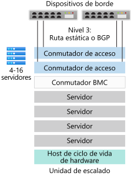
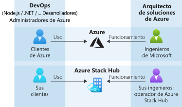

# Introducción a Azure Stack Hub

Azure Stack Hub es una extensión de Azure que ofrece una manera de ejecutar aplicaciones en un entorno local y proporcionar servicios de Azure en su centro de datos. Con una plataforma de nube coherente, las organizaciones pueden tomar decisiones de tecnología con confianza basándose en los requisitos empresariales, en lugar de tomar decisiones empresariales basándose en las limitaciones de la tecnología.

## ¿Por qué usar Azure Stack Hub?

Azure proporciona una plataforma completa en la que los desarrolladores pueden compilar aplicaciones modernas. Sin embargo, algunas aplicaciones basadas en la nube se enfrentan a obstáculos como la latencia, una conectividad intermitente y las normativas. Azure y Azure Stack Hub habilitan nuevos casos de uso de nube híbrida para aplicaciones orientadas al cliente y aplicaciones internas de línea de negocio:

- **Soluciones perimetrales y desconectadas**. Para satisfacer los requisitos de latencia y conectividad, procese los datos en el entorno local en Azure Stack Hub y agréguelos después a Azure para analizarlos con la lógica de aplicaciones común entre ambos. Incluso puede implementar Azure Stack Hub desconectado de Internet sin conectividad con Azure. Piense, por ejemplo, en plantas de producción, cruceros o pozos mineros.

- **Aplicaciones en la nube que cumplen diversas regulaciones**. Desarrolle e implemente aplicaciones en Azure con total flexibilidad de implementación en el entorno local con Azure Stack Hub para satisfacer sus requisitos de cumplimiento normativo o de directivas. No es necesario realizar ningún cambio de código. Algunos ejemplos de aplicaciones son la auditoría global, los informes financieros, las operaciones de cambio de divisas, los juegos en línea y los informes de gastos.

- **Modelo de aplicación en la nube en el entorno local**. Use las arquitecturas de servicios, contenedores, sin servidor y microservicios de Azure para actualizar y ampliar las aplicaciones existentes o crear otras nuevas. Utilice procesos de DevOps coherentes entre Azure en la nube y Azure Stack Hub en el entorno local para acelerar la modernización de aplicaciones críticas fundamentales.

## Arquitectura de Azure Stack Hub

Los sistemas integrados de Azure Stack Hub constan de bastidores de entre 4 y 16 servidores creados por asociados de hardware de confianza que se entregan directamente en el centro de datos. Tras la entrega, un proveedor de soluciones trabajará con usted para implementar el sistema integrado y garantizar que la solución de Azure Stack Hub cumple sus requisitos empresariales. Puede preparar el centro de datos asegurándose de que todo lo relacionado con la alimentación y la refrigeración, la conectividad de borde y el resto de requisitos de integración del centro de datos está en funcionamiento.

> Para más información acerca de la experiencia de integración del centro de datos de Azure Stack Hub, consulte [Integración del centro de datos de Azure Stack Hub](azure-stack-customer-journey.md).

Azure Stack Hub se basa en hardware estándar del sector y se administra con las mismas herramientas que ya usa para administrar las suscripciones de Azure. Como resultado, puede aplicar procesos de DevOps coherentes tanto si está conectado a Azure como si no.

La arquitectura de Azure Stack Hub le permite proporcionar servicios de Azure en el perímetro para ubicaciones remotas o con conectividad intermitente, e incluso desconectadas de Internet. Puede crear soluciones híbridas que procesen datos localmente en Azure Stack Hub y, después, agregarlos a Azure para su posterior análisis y procesamiento. Por último, como Azure Stack Hub se instala de forma local, puede cumplir requisitos específicos normativos o de directivas con la flexibilidad que supone implementar las aplicaciones de la nube en el entorno local sin necesidad de hacer cambios en el código.

## Opciones de implementación

Los sistemas integrados de Azure Stack Hub se ofrecen gracias a una asociación entre Microsoft y sus asociados de hardware, que permite crear una solución que ofrece innovación dirigida a la nube y sencillez en la administración de la computación. Como Azure Stack Hub se ofrece como un sistema en el que el software y el hardware están perfectamente integrados, tendrá la flexibilidad y el control que necesita, así como la capacidad de innovar desde la nube.

Un sistema integrado de Azure Stack Hub puede estar compuesto de 4 a 16 servidores y se le denomina una *unidad de escalado*. Microsoft y el asociado de hardware admiten de forma conjunta los sistemas integrados. El diagrama siguiente muestra un ejemplo de una unidad de escalado. 

. 

<!---add info and image on regions, etc--->

### Modelos de conexión

Puede implementar Azure Stack Hub, ya sea **con conexión** a Internet (y a Azure) o **sin conexión**. 

> Para más información, consulte las consideraciones para modelos de implementación [con conexión](azure-stack-connected-deployment.md) y [sin conexión](azure-stack-disconnected-deployment.md).

### Proveedor de identidades 

Azure Stack Hub usa Azure Active Directory (Azure AD) o los Servicios de federación de Active Directory (AD FS). Azure AD es el proveedor de identidades multiinquilino basado en la nube de Microsoft. La mayoría de los escenarios híbridos con implementaciones con conexión a Internet usan Azure AD como almacén de identidades.

Para las implementaciones desconectadas de Azure Stack Hub, tendrá que usar AD FS. Los proveedores de recursos de Azure Stack Hub y otras aplicaciones funcionan de manera similar con AD FS o Azure AD. Azure Stack Hub incluye su propia instancia de Active Directory, así como una instancia de Graph API de Active Directory.

## ¿Cómo se administra Azure Stack Hub?

Azure Stack Hub usa el mismo modelo de operaciones que Azure. Un operador de Azure Stack Hub puede proporcionar diversos servicios y aplicaciones a los usuarios inquilinos, al igual que hace Microsoft con los servicios de Azure. 

Puede administrar Azure Stack Hub con el portal de administración, el portal de usuarios o [PowerShell](/powershell/azure/azure-stack/overview?view=azurestackps-1.7.1). Cada uno de los portales de Azure Stack Hub cuenta con el respaldo de instancias independientes de Azure Resource Manager. Un **operador de Azure Stack Hub** usa el portal de administración para administrar Azure Stack Hub y para hacer tareas como crear ofertas para inquilinos y mantener y supervisar el estado del sistema integrado. El portal de usuarios proporciona una experiencia de autoservicio para el consumo de recursos de nube, como máquinas virtuales, cuentas de almacenamiento y aplicaciones web.

> Para más información acerca de cómo administrar Azure Stack Hub mediante el portal de administración, consulte el [inicio rápido del portal de administración de Azure Stack Hub](azure-stack-manage-portals.md).

Como operador de Azure Stack Hub, puede ofrecer [máquinas virtuales](./tutorial-offer-services.md?view=azs-2002), [aplicaciones web](azure-stack-app-service-overview.md), [SQL Server](azure-stack-tutorial-sql.md) de alta disponibilidad y bases de datos de [MySQL Server](azure-stack-tutorial-mysql.md). También puede usar [plantillas de inicio rápido de Azure Resource Manager para Azure Stack Hub](https://github.com/Azure/AzureStack-QuickStart-Templates) para implementar SharePoint, Exchange y mucho más.

Un operador puede administrar Azure Stack Hub con el [portal de administración](azure-stack-manage-portals.md) o con [PowerShell](/powershell/azure/azure-stack/overview?view=azurestackps-1.7.1). Puede configurar Azure Stack Hub para [prestar servicios](service-plan-offer-subscription-overview.md) a inquilinos mediante planes, ofertas, cuotas y suscripciones. Los usuarios inquilinos pueden suscribirse a varias ofertas. Las ofertas pueden tener uno o varios planes, y los planes pueden tener uno o varios servicios. Los operadores también administran la capacidad y responden a las alertas.

Los usuarios utilizan los servicios que ofrece el operador. Los usuarios pueden aprovisionar, supervisar y administrar los servicios a los que se han suscrito, como Web Apps, Storage y Virtual Machines. Los usuarios pueden administrar Azure Stack Hub con el portal de usuarios o con PowerShell.

> Para más información acerca de cómo administrar Azure Stack Hub, dónde usar qué cuentas, las responsabilidades típicas del operador, qué decir a los usuarios y cómo obtener ayuda, revise los [aspectos básicos de administración de Azure Stack Hub](azure-stack-manage-basics.md).

## Proveedores de recursos

Los proveedores de recursos son servicios web que forman la base de todos los servicios IaaS y PaaS de Azure Stack Hub. Azure Resource Manager utiliza distintos proveedores de recursos para proporcionar acceso a los servicios. Cada uno de estos proveedores de recursos le ayuda a configurar y controlar sus respectivos recursos. Los administradores de servicios también pueden agregar nuevos proveedores de recursos personalizados.

### Proveedores de recursos fundamentales

Hay tres proveedores de recursos de IaaS fundamentales:

- **Proceso**: El proveedor de recursos de proceso permite a los inquilinos de Azure Stack Hub crear sus propias máquinas virtuales. El proveedor de recursos de Compute incluye la capacidad de crear tanto máquinas virtuales como extensiones de máquina virtual. El servicio de extensión de máquinas virtuales ayuda a ofrecer funcionalidades de IaaS a máquinas virtuales Windows y Linux. Por ejemplo, puede usar el proveedor de recursos de Compute para aprovisionar una máquina virtual Linux y ejecutar scripts de Bash durante la implementación para configurar la máquina virtual.
- **Proveedor de recursos de red**: El proveedor de recursos de red ofrece una serie de características de Redes definidas por software (SDN) y Virtualización de función de red (NFV) a la nube privada. El proveedor de recursos de red puede usarse para crear recursos, como equilibradores de carga de software, direcciones IP públicas, grupos de seguridad de red y redes virtuales.
- **Proveedor de recursos de Storage**: El proveedor de recursos de Storage ofrece cuatro servicios de almacenamiento compatibles con Azure: [Blob](/azure/storage/common/storage-introduction#blob-storage), [Queue](/azure/storage/common/storage-introduction#queue-storage), [Table](/azure/storage/common/storage-introduction#table-storage) y administración de cuentas de [Key Vault](/azure/key-vault/), que proporciona administración y auditoría de secretos, como contraseñas y certificados. También ofrece un servicio de administración del almacenamiento en la nube para facilitar la administración del proveedor de los servicios de Storage compatibles con Azure. Azure Storage proporciona la flexibilidad necesaria para almacenar y recuperar grandes cantidades de datos no estructurados, como documentos y archivos multimedia con Blobs de Azure y datos estructurados basados en NoSQL con Tablas de Azure.

### Proveedores de recursos opcionales

Hay tres proveedores de recursos de PaaS opcionales que puede implementar y usar con Azure Stack Hub:

- **App Service**: [Azure App Service en Azure Stack Hub](azure-stack-app-service-overview.md) es una oferta de plataforma como servicio de Microsoft Azure disponible en Azure Stack Hub. El servicio habilita a sus clientes internos o externos para crear aplicaciones de Azure Functions, API y web para cualquier plataforma o dispositivo.
- **SQL Server**: Use el [proveedor de recursos de SQL Server](azure-stack-sql-resource-provider.md) para ofrecer las bases de datos de SQL como servicio de Azure Stack Hub. Después de instalar el proveedor de recursos y conectarse a una o varias instancias de SQL Server, usted y sus usuarios pueden crear bases de datos para aplicaciones nativas en la nube, sitios web que usan SQL y otras cargas de trabajo que usan SQL.
- **MySQL Server**: Use el [proveedor de recursos de MySQL Server](azure-stack-mysql-resource-provider-deploy.md) para ofrecer las bases de datos de MySQL como un servicio de Azure Stack Hub. El proveedor de recursos MySQL se ejecuta como un servicio en una máquina virtual Windows Server 2019 Server Core.

## Pasos siguientes

[Comparación de la cartera de Azure Stack Hub](compare-azure-azure-stack.md)

[Conceptos básicos de administración](azure-stack-manage-basics.md)

[Inicio rápido: Uso del portal de administración de Azure Stack Hub](azure-stack-manage-portals.md)

[Descripción de la utilización y la facturación](azure-stack-usage-reporting.md)
