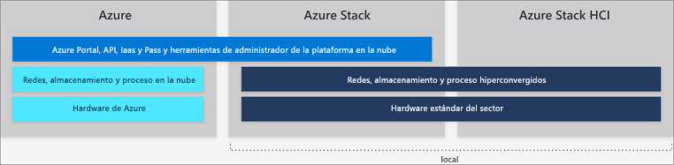

# Diferencias entre Azure global, Azure Stack Hub y Azure Stack HCI

Microsoft proporciona Azure y la familia de servicios de Azure Stack Hub en un ecosistema de Azure. Utilice el mismo modelo de aplicación, portales de autoservicio y API con Azure Resource Manager para brindar funcionalidades basadas en la nube si su empresa usa Azure global o recursos locales.

En este artículo se describen las diferencias entre las funcionalidades de Azure global, Azure Stack Hub y Azure Stack HCI. También proporciona recomendaciones para escenarios comunes para ayudarle a elegir la mejor opción para la entrega de servicios en la nube de Microsoft para su organización.

## Azure global

Microsoft Azure es conjunto en constante expansión de servicios en la nube para ayudar a su organización a satisfacer sus necesidades comerciales. Le otorga la libertad de crear, administrar e implementar aplicaciones en una red mundial enorme con sus herramientas y plataformas favoritas.

Azure global ofrece más de 100 servicios disponibles en 54 regiones de todo el mundo. Para la lista más reciente de servicios de Azure global, consulte los [*Productos disponibles por región*](https://azure.microsoft.com/regions/services). Los servicios disponibles en Azure se enumeran por categoría y también por disponibilidad general o en versión preliminar.

Para más información acerca de los servicios de Azure global, consulte [Introducción a Azure](https://docs.microsoft.com/azure/#pivot=get-started&panel=get-started1).

## Azure Stack Hub

Azure Stack Hub es una extensión de Azure que incorpora a entornos locales la agilidad y la innovación de la informática en la nube. Implementado en local, Azure Stack Hub puede utilizarse para proporcionar servicios coherentes con Azure, ya sea conectados a Internet (y a Azure) o en entornos desconectados sin conexión a Internet. Azure Stack Hub usa las mismas tecnologías subyacentes que Azure global, entre las cuales se incluyen los componentes básicos de la infraestructura como servicio (IaaS), del software como servicio (SaaS) y las funcionalidades de la plataforma como servicio (PaaS) opcionales. Estas son algunas de ellas:

- Máquinas virtuales de Azure para Windows y Linux
- Aplicaciones web y funciones de Azure
- Azure Key Vault
- Azure Resource Manager
- Azure Marketplace
- Contenedores
- Herramientas de administración (planes, ofertas, RBAC, etc.)

Las funcionalidades de PaaS de Azure Stack Hub son opcionales porque Azure Stack Hub no lo opera Microsoft, sino nuestros clientes. Esto significa que puede ofrecer cualquier servicio de PaaS que desee a los usuarios finales si está preparado para apartar la infraestructura y los procesos subyacentes de estos usuarios. Sin embargo, Azure Stack Hub incluye varios proveedores de servicios de PaaS opcionales, como App Service, bases de datos SQL y bases de datos MySQL. Estos se entregan como proveedores de recursos, multiinquilino, listos, actualizados con el tiempo con actualizaciones estándar de Azure Stack Hub y visibles en el portal de Azure Stack Hub; además, se integran bien con Azure Stack Hub.

Además de los proveedores de recursos descritos anteriormente, hay servicios de PaaS adicionales disponibles que se han probado, como [soluciones basadas en plantillas de Azure Resource Manager](https://github.com/Azure/AzureStack-QuickStart-Templates) que se ejecutan en IaaS. Como operador de Azure Stack Hub puede ofrecerlos como servicios de PaaS a los usuarios, junto con:

- Service Fabric
- Kubernetes Container Service
- Cadena de bloques Ethereum
- Cloud Foundry

### Casos de uso de ejemplo para Azure Stack Hub:

- Creación de modelos financieros
- Datos clínicos y notificaciones
- Análisis de dispositivos IoT
- Optimización del surtido comercial
- Optimización de la cadena de suministro
- IoT industrial
- Mantenimiento predictivo
- Ciudad inteligente
- Participación ciudadana

Para más información sobre Azure Stack Hub, consulte [¿Qué es Azure Stack Hub?](azure-stack-overview.md).

## Azure Stack HCI

Las soluciones de [Azure Stack HCI](azure-stack-hci-overview.md) le permiten ejecutar las máquinas virtuales localmente y conectarse fácilmente a Azure con una solución de infraestructura hiperconvergida (HCI). Compile y ejecute aplicaciones en la nube mediante servicios de Azure coherentes locales para cumplir los requisitos reglamentarios o técnicos. Además de ejecutar aplicaciones virtualizadas locales, Azure Stack HCI permite reemplazar y consolidar la infraestructura de servidor con caducidad y conectarse a los servicios en la nube de Azure mediante el Centro de administración de Windows.

Azure Stack HCI proporciona soluciones de HCI validadas con Hyper-V y espacios de almacenamiento directo y el centro de datos definido por software de Windows Server 2019 (SDDC). El Centro de administración de Windows se usa para la administración y el acceso integrado a servicios de Azure como:

- Azure Backup
- Azure Site Recovery
- Azure Monitor y actualizaciones

Para una lista actualizada de los servicios de Azure a los que puede conectar Azure Stack HCI, consulte [Connecting Windows Server to Azure hybrid services](https://docs.microsoft.com/windows-server/azure-hybrid-services/index) (Conexión de Windows Server a los servicios híbridos de Azure).

### Casos de uso de ejemplo para Azure Stack HCI

- Sistemas de oficina remota o sucursal
- Consolidación del centro de datos
- Infraestructura de escritorio virtual
- Infraestructura crítica para la empresa
- Almacenamiento de bajo costo
- Alta disponibilidad y recuperación ante desastres en la nube
- Aplicaciones empresariales como SQL Server

Visite el [sitio web de Azure Stack HCI](https://azure.microsoft.com/overview/azure-stack/hci/) para ver las más de 70 soluciones de Azure Stack HCI actualmente disponibles de los asociados de Microsoft.

## Pasos siguientes

[Aspectos básicos de administración de Azure Stack Hub](azure-stack-manage-basics.md)

[Inicio rápido: Uso del portal de administración de Azure Stack Hub](azure-stack-manage-portals.md)
