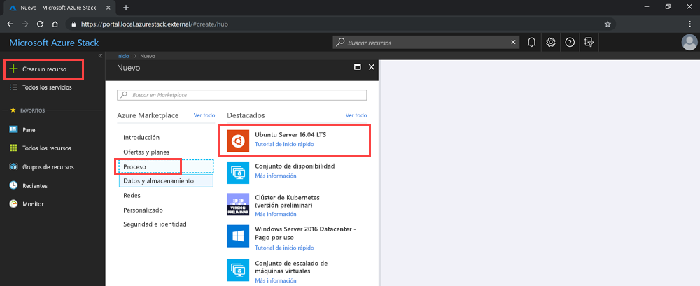

# <a name="deploy-a-linux-vm-to-host-a-web-app-in-azure-stack-hub"></a>Implementación de una máquina virtual Linux para hospedar una aplicación web en Azure Stack Hub

Puede crear e implementar una máquina virtual (VM) Linux básica utilizando la imagen de Ubuntu de Azure Marketplace para hospedar una aplicación web que ha creado con un marco web. 

Esta VM puede hospedar aplicaciones web mediante:

- **Python**: Entre los marcos web de Python comunes están Flask, Bottle y Django.
- **Go**: Entre los marcos comunes de Go están Revel, Martini, Gocraft/web y Gorilla. 
- **Ruby**: configure Ruby on Rails como un marco para distribuir sus aplicaciones web de Ruby. 
- **Java**: use Java para desarrollar aplicaciones web publicadas en un servidor de Apache Tomcat. Puede instalar Tomcat en Linux y, a continuación, implementar los archivos WAR de Java directamente en el servidor. 

Use las instrucciones de este artículo para empezar a trabajar con cualquier aplicación web, marco y tecnología de back-end que use el sistema operativo Linux. A continuación, puede usar Azure Stack Hub para administrar la infraestructura y las herramientas de administración de su tecnología para ocuparse de las tareas de mantenimiento de la aplicación.

## <a name="deploy-a-linux-vm-for-a-web-app"></a>Implementación de una máquina virtual Linux para una aplicación web

En este proceso, debe crear la clave secreta, usar la imagen base de la VM Linux, especificar los atributos particulares de la VM y, a continuación, crear la VM. Después de crear la VM, debe abrir los puertos necesarios para trabajar con la VM y para que la VM pueda hospedar la aplicación. A continuación, debe crear el nombre DNS. Por último, debe conectarse a la VM y actualizarla mediante la utilidad apt-get. Después de completar el proceso, tendrá una máquina virtual en su instancia de Azure Stack Hub lista para hospedar su aplicación web.

Antes de comenzar, asegúrese de que tiene todo lo que necesita preparado.

## <a name="prerequisites"></a>Prerequisites

- Una suscripción a Azure Stack Hub, con acceso a la imagen de Ubuntu Server 16.04 LTS. Puede usar una versión posterior de la imagen, pero estas instrucciones se han escrito específicamente para 16.04 LTS. Si no tiene esta imagen, póngase en contacto con su operador de nube para obtener la imagen en Marketplace de Azure Stack Hub.

## <a name="deploy-the-vm-by-using-the-portal"></a>Implementación de la VM mediante el portal

Para implementar la VM, siga las instrucciones que aparecen en las secciones siguientes.

### <a name="create-your-vm"></a>Creación de su máquina virtual

1. Cree una clave pública Secure Shell (SSH) para el servidor. Para obtener más información, consulte [How to use an SSH public key](azure-stack-dev-start-howto-ssh-public-key.md) (Uso de una clave pública SSH).
1. En el portal de Azure Stack Hub, seleccione **Crear un recurso** > **Proceso** > **Ubuntu Server 16.04 LTS**.

    

4. En el panel **Crear una máquina virtual**, en **1. Configuración básica**:

    a. Escriba el **nombre de la VM**.

    b. Seleccione el **tipo de disco de VM**, ya sea **SSD Premium** (para discos Prémium [SSD]) o **HDD estándar** (para discos estándar [HDD]).

    c. Escriba su **nombre de usuario**.

    d. Seleccione el **Tipo de autenticación** como **Clave pública SSH**.

    e. Recupere la clave pública SSH que ha creado. Ábrala en un editor de texto, copie la clave y, a continuación, péguela en el cuadro **Clave pública SSH**. Incluya el texto desde `---- BEGIN SSH2 PUBLIC KEY ----` hasta `---- END SSH2 PUBLIC KEY ----`. Pegue todo el bloque de texto en el cuadro de la clave:

    ```text  
    ---- BEGIN SSH2 PUBLIC KEY ----
    Comment: "rsa-key-20190207"
    <Your key block>
    ---- END SSH2 PUBLIC KEY ----
    ```

    f. Seleccione la suscripción para la instancia de Azure Stack Hub.

    g. Cree un nuevo grupo de recursos o use uno existente, dependiendo de cómo quiera organizar los recursos de la aplicación.

    h. Seleccione su ubicación. El Kit de desarrollo de Azure Stack (ASDK) suele estar en una región *local*. La ubicación depende de su instancia de Azure Stack Hub.
1. En **2. Tamaño**, escriba:
    - Seleccione el tamaño de los datos y la RAM de la máquina virtual disponible en su instancia de Azure Stack Hub.
    - Puede examinar la lista o filtrar por el tamaño de la VM mediante **Tipo de proceso**, **CPU** y **Espacio de almacenamiento**.
    
    > [!NOTE]
    > - Los precios que se presentan son estimaciones en su moneda local. Incluyen solo los costos de infraestructura de Azure y los descuentos aplicables a la suscripción y la ubicación. No incluyen los costos de software aplicables. 
    > - El editor de la imagen seleccionada determina los tamaños recomendados según los requisitos de hardware y software.
    > - El uso de discos estándar (HDD) en lugar de discos Prémium (SSD) puede afectar al rendimiento de sistema operativo.

1. En **3. Configurar características opcionales**, escriba:

    a. En **Alta disponibilidad**, seleccione un conjunto de disponibilidad. Para proporcionar redundancia a la aplicación, agrupe dos máquinas virtuales o más en un conjunto de disponibilidad. Esta configuración garantiza que, durante un evento de mantenimiento planeado o no planeado, al menos una máquina virtual estará disponible y cumplirá el 99,95 % del Acuerdo de Nivel de Servicio (SLA) de Azure. No se puede cambiar el conjunto de disponibilidad de una máquina virtual después de crearlo.

    b. En **Almacenamiento**, seleccione **Discos Premium (SSD)** o **Discos estándar (HDD)** . Los discos Premium (SSD) están respaldados por unidades de estado sólido y ofrecen coherencia y un rendimiento con baja latencia. Proporcionan el mejor equilibrio entre precio y rendimiento, y son ideales para aplicaciones intensivas de E/S y cargas de trabajo de producción. Los discos estándar están respaldados por unidades magnéticas y son preferibles para las aplicaciones en las que se accede con poca frecuencia a los datos. Los discos con redundancia de zona están respaldados por almacenamiento con redundancia de zona (ZRS), que replica los datos en varias zonas y están disponibles aunque una de las zonas está inactiva. 

    c. Seleccione **Usar discos administrados**. Cuando habilita esta característica, Azure administra automáticamente la disponibilidad de los discos. Disfrutará de redundancia de datos y tolerancia a errores, sin tener que crear y administrar cuentas de almacenamiento por su cuenta. Es posible que los discos administrados no estén disponibles en todas las regiones. Para más información, consulte [Introducción a Azure Managed Disks](https://docs.microsoft.com/azure/virtual-machines/windows/managed-disks-overview).

    d. Para configurar la red, seleccione **Red virtual**. Las redes virtuales están aisladas lógicamente entre sí en Azure. Puede configurar sus intervalos de direcciones IP, subredes, tablas de rutas, puertas de enlace y configuraciones de seguridad, de manera muy similar a como lo haría con una red tradicional en su centro de datos. Las máquinas virtuales de la misma red virtual puede acceder unas a otras de forma predeterminada. 

    e. Para configurar la subred, seleccione **Subred**. Una subred es un intervalo de direcciones IP en la red virtual. Puede usar una subred para aislar las máquinas virtuales entre sí o de Internet. 

    f. Para configurar el acceso a su VM o a los servicios que se ejecutan en la VM, seleccione **Dirección IP pública**. Use una dirección IP pública si quiere comunicarse con la máquina virtual desde fuera de la red virtual. 

    g. En **Grupo de seguridad de red**, seleccione **Básico** o **Avanzado**. Defina reglas que permitan o denieguen el tráfico de red a la VM. 

    h. Para configurar el acceso para protocolos comunes o personalizados a la VM, seleccione **Puertos de entrada públicos**. El servicio especifica el intervalo de puerto y protocolo de destino para esta regla. Puede elegir un servicio predefinido, como el Protocolo de escritorio remoto (RDP) o SSH, o proporcionar un intervalo de puertos personalizado. 
        Para el servidor web, use HTTP (80), HTTPS (443) y SSH (22) abierto. Si va a administrar la máquina mediante una conexión RDP, abra el puerto 3389.

    i. Para agregar extensiones a la VM, seleccione **Extensiones**. Las extensiones agregan nuevas características, como la administración de configuración o la protección antivirus, a su máquina virtual. 

    j. Deshabilite o habilite la opción **Supervisión**. A fin de ayudar a diagnosticar problemas de inicio, puede usar la supervisión para capturar la salida de la consola serie y las capturas de pantalla de una máquina virtual que se ejecuta en un host. 

    k. Para especificar la cuenta de almacenamiento que contiene las métricas, seleccione **Cuenta de almacenamiento de diagnóstico**. Las métricas se escriben en una cuenta de almacenamiento para que pueda analizarlas con sus propias herramientas. 

    l. Seleccione **Aceptar**.

1. Revise **4. Resumen**:
    - El portal valida su configuración.
    - Para volver a usar la configuración con un flujo de trabajo de Azure Resource Manager, puede descargar la plantilla de Azure Resource Manager para su VM.
    - Una vez superada la validación, seleccione **Aceptar**. La implementación de la VM tarda varios minutos en completarse.

### <a name="specify-the-open-ports-and-dns-name"></a>Especificar los puertos abiertos y el nombre DNS

Para que la aplicación web sea accesible para los usuarios de su red, abra los puertos que se usan para conectarse a la máquina y agregue un nombre DNS descriptivo, como *mywebapp.local.cloudapp.azurestack.external*, que los usuarios puedan usar en sus exploradores web.

#### <a name="open-inbound-ports"></a>Puertos de entrada abiertos

Puede modificar el proveedor de destino y el intervalo de puertos para un servicio predefinido, como RDP o SSH, o bien proporcionar un intervalo de puertos personalizado. Por ejemplo, puede trabajar con el intervalo de puertos de su marco web. Go, por ejemplo, se comunica en el puerto 3000.

1. Abra el portal de Azure Stack Hub de su inquilino.

1. Busque su VM. Es posible que haya anclado la VM al panel; si no, puede buscarla en el cuadro **Buscar recursos**.

1. Seleccione **Redes** en el panel de VM.

1. Seleccione la regla **Agregar puerto de entrada** para abrir un puerto.

1. En **Origen**, deje la selección predeterminada, **Cualquiera**.

1. En **Intervalo de puertos de origen**, deje el carácter comodín (*).

1. En **Intervalo de puertos de destino**, especifique el puerto que quiere abrir, por ejemplo **3000**.

1. En **Protocolo**, deje la selección predeterminada, **Cualquiera**.

1. En **Acción**, seleccione **Permitir**.

1. En **Prioridad**, deje el valor predeterminado.

1. Complete los campos **Nombre** y **Descripción** para recordar fácilmente el motivo por el que el puerto está abierto.

1. Seleccione **Agregar**.

#### <a name="add-a-dns-name-for-your-server"></a>Agregar un nombre DNS para el servidor

Además, puede crear un nombre DNS para el servidor, de modo que los usuarios puedan conectarse a su sitio web mediante una dirección URL.

1. Abra el portal de Azure Stack Hub de su inquilino.

1. Busque su VM. Es posible que haya anclado la VM al panel; si no, puede buscarla en el cuadro **Buscar recursos**.

1. Seleccione **Información general**.

1. En **VM**, seleccione **Configurar**.

1. En **Asignación**, seleccione **Dinámica**.

1. Escriba la etiqueta del nombre DNS, como **mywebapp**, de modo que su dirección URL completa se convierta en *mywebapp.local.cloudapp.azurestack.external* (para una aplicación ASDK).

### <a name="connect-via-ssh-to-update-your-vm"></a>Conectarse a través de SSH para actualizar la VM

1. En la misma red que su instancia de Azure Stack Hub, abra el cliente SSH. Para obtener más información, consulte [Uso de una clave pública SSH](azure-stack-dev-start-howto-ssh-public-key.md).

1. Escriba los siguientes comandos:

    ```bash  
        sudo apt-get update
        sudo apt-get -y upgrade
    ```

## <a name="next-steps"></a>Pasos siguientes

Consulte [Configurar un entorno de desarrollo en Azure Stack Hub](azure-stack-dev-start.md) para conocer el procedimiento.
