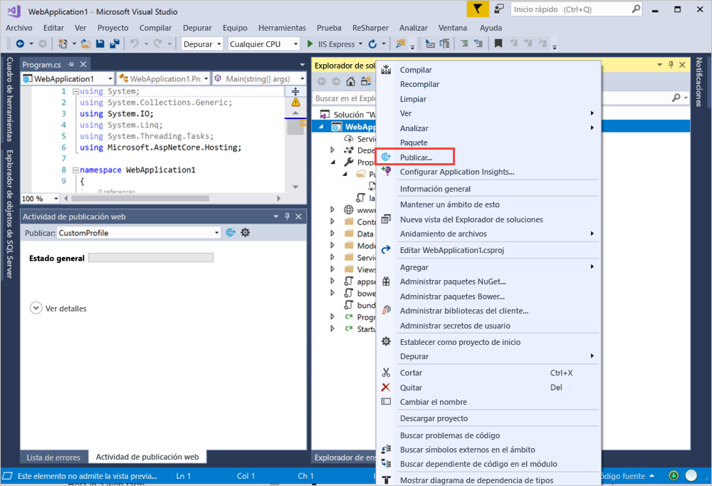
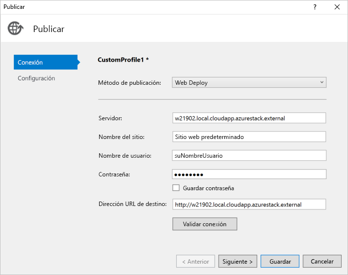

# <a name="deploy-a-c-aspnet-web-app-to-a-vm-in-azure-stack-hub"></a>Implementación de una aplicación web de C# ASP.NET en una máquina virtual en Azure Stack Hub

Puede crear una máquina virtual para hospedar la aplicación web de C# ASP.NET en Azure Stack Hub. En este artículo se indican las instrucciones que deben seguirse al instalar el servidor, configurarlo para hospedar su aplicación web de C# ASP.NET y, a continuación, implementar la aplicación directamente desde Visual Studio.

En este artículo se usa una aplicación C# 6.0 que usa ASP.NET Core 2.2 y se ejecuta en un servidor Windows Server 2016.

## <a name="create-a-vm"></a>Crear una VM

1. Cree una [máquina virtual de Windows Server](azure-stack-quick-windows-portal.md).

1. Para instalar los componentes IIS (con la Consola de administración) y ASP.NET 4.6 en la VM, ejecute el siguiente script:

    ```PowerShell  
    # Install IIS (with Management Console)
    Install-WindowsFeature -name Web-Server -IncludeManagementTools
    
    # Install ASP.NET 4.6
    Install-WindowsFeature Web-Asp-Net45
    
    # Install Web Management Service
    Install-WindowsFeature -Name Web-Mgmt-Service
    ```

1. Descargue [Web Deploy v3.6](https://www.microsoft.com/download/details.aspx?id=43717). Instálelo desde el archivo MSI y, a continuación, habilítelo en todas las características.

1. Instale el conjunto de hospedaje de .NET Core  2.2 en el servidor. Para obtener instrucciones, consulte la página del [instalador de .NET Core](https://dotnet.microsoft.com/download/dotnet-core/2.2). Asegúrese de que está utilizando la misma versión de .NET Core en la máquina de desarrollo y el servidor de destino.

1. Vuelva al portal de Azure Stack Hub y abra los puertos que se indican en la configuración de red para la máquina virtual.

    a. Abra el portal de Azure Stack Hub de su inquilino.

    b. Busque su VM. Es posible que haya anclado la VM al panel; si no, puede buscarla en el cuadro **Buscar recursos**.

    c. Seleccionar **Redes**.

    d. Seleccione **Agregar regla de puerto de entrada** en la máquina virtual.

    e. Agregue una regla de seguridad de entrada para los puertos siguientes:

    | Port | Protocolo | Descripción |
    | --- | --- | --- |
    | 80 | HTTP | El protocolo de transferencia de hipertexto (HTTP) es el protocolo que se utiliza para entregar páginas web desde los servidores. Los clientes se conectan mediante HTTP con un nombre DNS o dirección IP. |
    | 443 | HTTPS | El protocolo de transferencia de hipertexto con cifrado de Capa de sockets seguros (HTTPS) es una versión segura de HTTP que requiere un certificado de seguridad y permite la transmisión cifrada de información.  |
    | 22 | SSH | Secure Shell (SSH) es un protocolo de red cifrado para proteger las comunicaciones. Usará esta conexión con un cliente SSH para configurar la máquina virtual e implementar la aplicación. |
    | 3389 | RDP | Opcional. El Protocolo de escritorio remoto permite que una conexión de escritorio remoto utilice una interfaz gráfica de usuario de su equipo.   |
    | 8172 | Personalizado | El puerto que usa WebDeploy. |

    Para cada puerto:

    a. En **Origen**, seleccione **Cualquiera**.

    b. En **Intervalo de puertos de origen**, escriba un asterisco ( **\*** ).

    c. En **Destino**, seleccione **Cualquiera**.

    d. En **Intervalo de puertos de destino**, agregue el puerto que quiere abrir.

    e. En **Protocolo**, seleccione **Cualquiera**.

    f. En **Acción**, seleccione **Permitir**.

    g. En **Prioridad**, deje el valor predeterminado.

    h. Complete los campos **Nombre** y **Descripción** para recordar fácilmente el motivo por el que el puerto está abierto.

    i. Seleccione **Agregar**.

1.  En la configuración de **Redes** para su máquina virtual en Azure Stack Hub, cree un nombre DNS para el servidor. Los usuarios pueden conectarse a su sitio web mediante la dirección URL.

    a. Abra el portal de Azure Stack Hub de su inquilino.

    b. Busque su VM. Es posible que haya anclado la VM al panel; si no, puede buscarla en el cuadro **Buscar recursos**.

    c. Seleccione **Información general**.

    d. En **VM**, seleccione **Configurar**.

    e. En **Asignación**, seleccione **Dinámica**.

    f. Escriba la etiqueta del nombre DNS, como **mywebapp**, de modo que su dirección URL completa se convierta en *mywebapp.local.cloudapp.azurestack.external*.

## <a name="create-an-app"></a>Creación de una aplicación 

Puede usar su propia aplicación web, o bien el ejemplo de [Publicar una aplicación de ASP.NET Core en Azure con Visual Studio](https://docs.microsoft.com/aspnet/core/tutorials/razor-pages/razor-pages-start?view=aspnetcore-2.2&tabs=visual-studio
). En este artículo se describe cómo crear y publicar una aplicación web de ASP.NET en una máquina virtual de Azure mediante la característica de publicación Azure Virtual Machines en Visual Studio 2017. Una vez que haya instalado su aplicación y se haya asegurado de que se ejecuta localmente, actualizará su destino de publicación para la máquina virtual Windows de su instancia de Azure Stack Hub.

## <a name="deploy-and-run-the-app"></a>Implementación y ejecución de la aplicación

Cree un destino de publicación para la máquina virtual en Azure Stack Hub.

1. En el **Explorador de soluciones**, haga clic con el botón derecho en el proyecto y seleccione **Publicar**.

    

1. En la ventana **Publicar**, seleccione **Nuevo perfil**.
1. Seleccione **IIS, FTP, etc**.
1. Seleccione **Publicar**.
1. En **Método de publicación**, seleccione **Web Deploy**.
1. En **Servidor**, escriba el nombre DNS que definió anteriormente, como *w21902.local.cloudapp.azurestack.external*.
1. En **Nombre del sitio**, escriba **Sitio web predeterminado**.
1. En **Nombre de usuario**, escriba el nombre de usuario de la máquina.
1. En **Contraseña**, escriba la contraseña de la máquina.
1. En **Dirección URL de destino**, escriba la dirección URL del sitio, como *mywebapp.local.cloudapp.azurestack.external*.

    

1. Para validar la configuración de Web Deploy, seleccione **Validar conexión** y, a continuación, elija **Siguiente**.
1. Establezca **Configuración** en **Versión**.
1. Establezca el **Marco de destino** como **netcoreapp2.2**.
1. Establezca el **Tiempo de ejecución de destino** como **Portátil**.
1. Seleccione **Guardar**.
1. Seleccione **Publicar**.
1. Vaya al nuevo servidor. Debería ver la aplicación web en ejecución.

    ```http  
        mywebapp.local.cloudapp.azurestack.external
    ```

## <a name="next-steps"></a>Pasos siguientes

- Consulte [Configurar un entorno de desarrollo en Azure Stack Hub](azure-stack-dev-start.md) para conocer el procedimiento.
- Obtenga información sobre las [implementaciones comunes para Azure Stack Hub como IaaS](azure-stack-dev-start-deploy-app.md).
- Para conocer el lenguaje de programación de C# y consultar recursos adicionales, consulte [la guía de C#](https://docs.microsoft.com/dotnet/csharp/).
