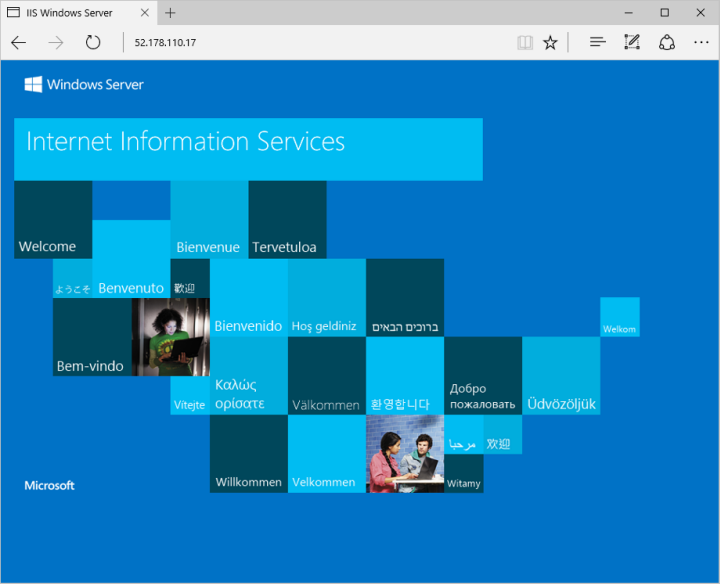

# <a name="quickstart-create-a-windows-server-virtual-machine-using-azure-cli-in-azure-stack-hub"></a>Inicio rápido: Creación de una máquina virtual Windows Server con la CLI de Azure en Azure Stack Hub

Puede crear una máquina virtual Windows Server 2016 mediante la CLI de Azure. Siga los pasos descritos en este artículo para crear y usar una máquina virtual. Este artículo también proporciona los siguientes pasos:

* Conectarse a la máquina virtual con un cliente remoto.
* Instalar al servidor web IIS y ver la página principal predeterminada.
* Realizar la limpieza de los recursos.

## <a name="prerequisites"></a>Prerrequisitos

* Asegúrese de que el operador de Azure Stack Hub haya agregado la imagen **Windows Server 2016** a Marketplace de Azure Stack Hub.

* Azure Stack Hub requiere una versión específica de la CLI de Azure para crear y administrar los recursos. Si no tiene la CLI de Azure configurada para Azure Stack Hub, siga los pasos que se indican para [instalarla y configurarla](azure-stack-version-profiles-azurecli2.md).

## <a name="create-a-resource-group"></a>Crear un grupo de recursos

Un grupo de recursos es un contenedor lógico en el que puede implementar y administrar recursos de Azure Stack Hub. En el entorno de Azure Stack Hub, ejecute el comando [az group create](/cli/azure/group#az-group-create) para crear un grupo de recursos.

> [!NOTE]
>  Se asignan valores para todas las variables en los ejemplos de código. Sin embargo, puede asignar nuevos valores si lo desea.

En el ejemplo siguiente, se crea un grupo de recursos denominado myResourceGroup en la ubicación local:

```cli
az group create --name myResourceGroup --location local
```

## <a name="create-a-virtual-machine"></a>Creación de una máquina virtual

Cree una máquina virtual con el comando [az vm create](/cli/azure/vm#az-vm-create). En el ejemplo siguiente se crea una máquina virtual denominada myVM. En este ejemplo se usa Demouser como nombre de usuario administrador y Demouser@123 como la contraseña de administrador. Actualice estos valores a un valor apropiado para su entorno.

```cli
az vm create \
  --resource-group "myResourceGroup" \
  --name "myVM" \
  --image "Win2016Datacenter" \
  --admin-username "Demouser" \
  --admin-password "Demouser@123" \
  --location local
```

Cuando se crea la máquina virtual, el parámetro **PublicIPAddress** de la salida contiene la dirección IP pública de la máquina virtual. Anote esta dirección porque la necesitará para usar la máquina virtual.

## <a name="open-port-80-for-web-traffic"></a>Apertura del puerto 80 para el tráfico web

Dado que en esta máquina virtual se va a ejecutar el servidor web IIS, debe abrir el puerto 80 para el tráfico de Internet.

Use el comando [az vm open-port](/cli/azure/vm) para abrir el puerto 80:

```cli
az vm open-port --port 80 --resource-group myResourceGroup --name myVM
```

## <a name="connect-to-the-virtual-machine"></a>Conexión a la máquina virtual

Use el siguiente comando para crear una conexión a Escritorio remoto con la máquina virtual. Reemplace "Dirección IP pública" con la dirección IP de la máquina virtual. Cuando se le pregunte, especifique el nombre de usuario y la contraseña que proporcionó cuando creó la máquina virtual.

```
mstsc /v <Public IP Address>
```

## <a name="install-iis-using-powershell"></a>Instalación de IIS mediante PowerShell

Ahora que ha iniciado sesión en la máquina virtual, puede usar PowerShell para instalar IIS. Inicie PowerShell en la máquina virtual y ejecute el siguiente comando:

```powershell
Install-WindowsFeature -name Web-Server -IncludeManagementTools
```

## <a name="view-the-iis-welcome-page"></a>Página principal de IIS

Puede usar un explorador de su elección para ver la página de bienvenida predeterminada de IIS. Use la dirección IP pública enumerada en la sección anterior para visitar la página predeterminada:



## <a name="clean-up-resources"></a>Limpieza de recursos

Borre los recursos que ya no necesite. Puede usar el comando [az group delete](/cli/azure/group#az-group-delete) para eliminar el grupo de recursos, la máquina virtual y todos los recursos relacionados.

```cli
az group delete --name myResourceGroup
```

## <a name="next-steps"></a>Pasos siguientes

En esta guía de inicio rápido ha implementado una máquina virtual básica con Windows Server. Para aprender más sobre las máquinas virtuales de Azure Stack Hub, continúe con el artículo [Consideraciones acerca de máquinas virtuales de Azure Stack Hub](azure-stack-vm-considerations.md).
