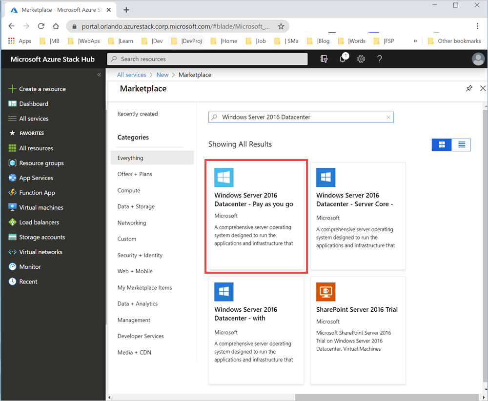
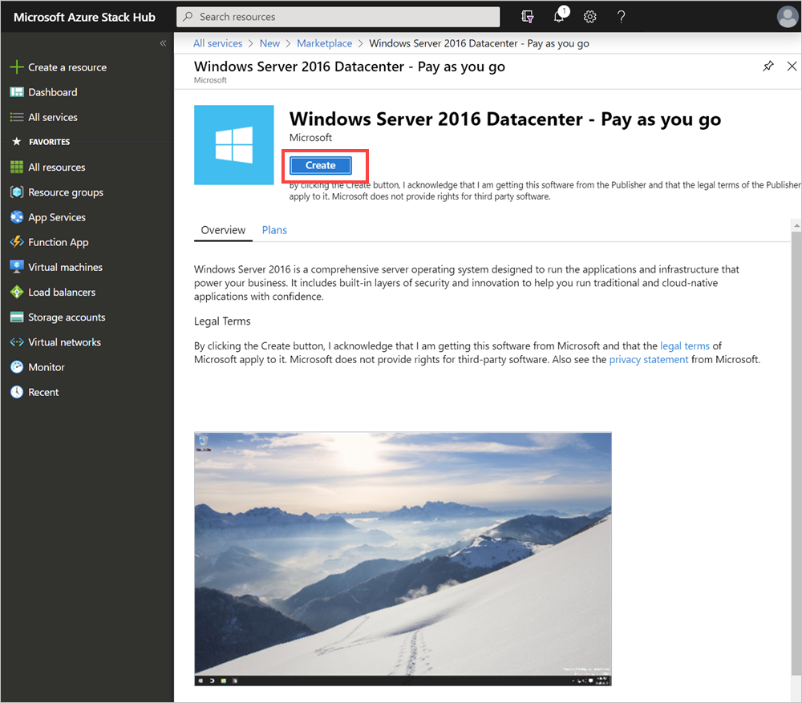
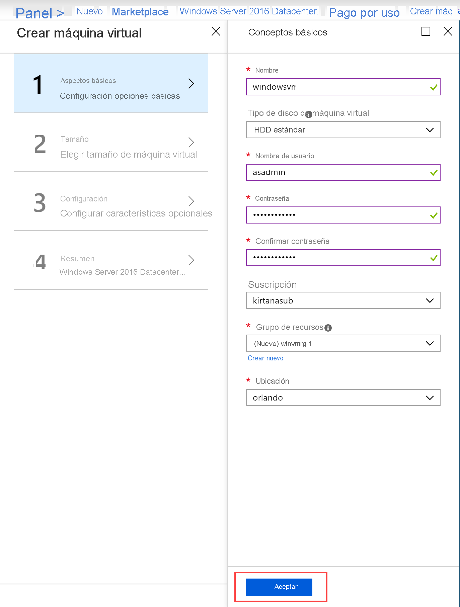
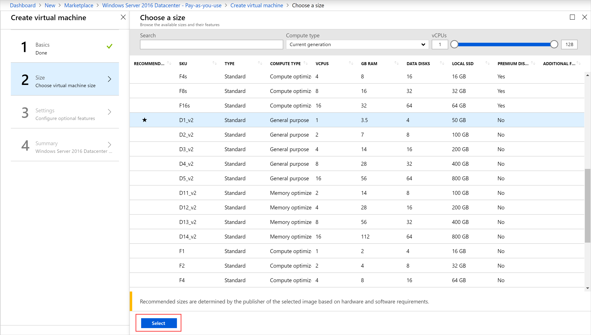
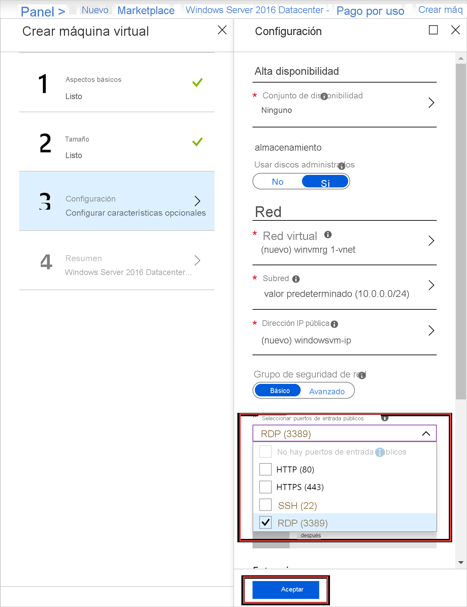
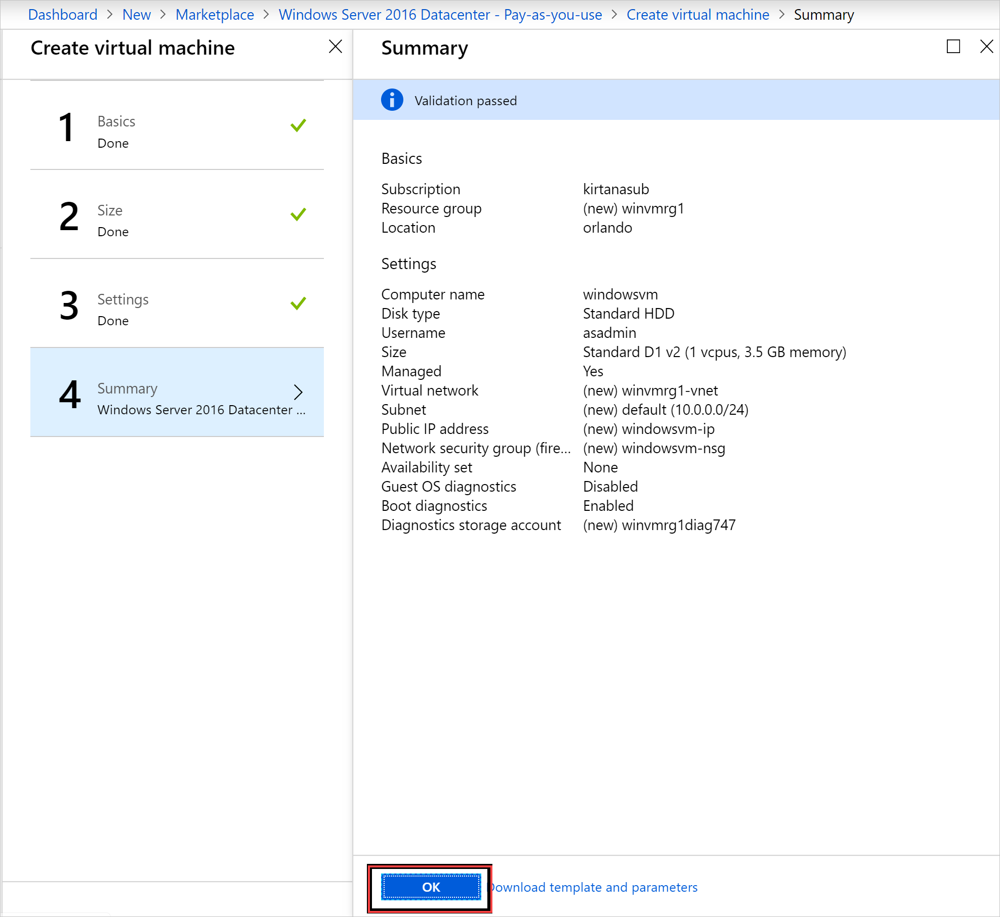
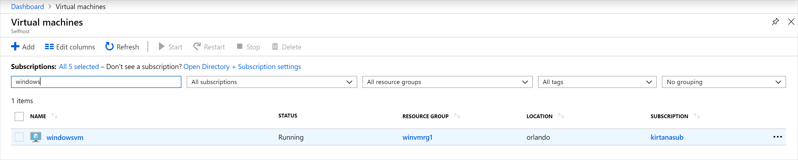

# Inicio rápido: Creación de una máquina virtual Windows Server con el portal de Azure Stack Hub

Obtenga información sobre cómo crear una máquina virtual (VM) Windows Server 2016 mediante el portal de Azure Stack Hub.

> [!NOTE]  
> Las capturas de pantalla de este artículo se han actualizado para que coincidan con la interfaz de usuario introducida con la versión 1808 de Azure Stack Hub. 1808 agrega compatibilidad para los *discos administrados* además de para los no administrados. Si usa una versión anterior, algunas imágenes como la selección de disco diferirán de las que se muestran en este artículo.  

## Inicio de sesión en el portal de Azure Stack Hub

Inicie sesión en el portal de Azure Stack Hub. La dirección del portal de Azure Stack Hub depende del producto de Azure Stack al que se vaya a conectar:

* Para obtener el Kit de desarrollo de Azure Stack (ASDK), vaya a: `https://portal.local.azurestack.external`.
* Para un sistema integrado de Azure Stack Hub, vaya a la dirección URL que proporciona su operador de Azure Stack Hub.

## Crear una VM

1. Seleccione **Crear un recurso** > **Proceso**. Busque` Windows Server 2016 Datacenter - Pay as you use`.
    Si no ve la entrada **Windows Server 2016 Datacenter - Pay-as-you-use**, póngase en contacto con su operador de nube de Azure Stack Hub y pida que se agregue la imagen al Marketplace de Azure Stack Hub. Para obtener instrucciones, el operador de la nube puede consultar [Creación y publicación de un elemento personalizado de Marketplace de Azure Stack Hub](../operator/azure-stack-create-and-publish-marketplace-item.md).

    

1. Seleccione **Crear**.

    

1. Escriba un **nombre**, **tipo de disco**, **nombre de usuario** y **contraseña** en **Aspectos básicos**. Elija una **suscripción**. Cree un **grupo de recursos**, o seleccione uno ya existente, seleccione una **ubicación** y, después, seleccione **Aceptar**.

    

1. Seleccione **D1_v2** en **Tamaño** y, después, elija **Seleccionar**.

    

1. En la página **Configuración**, realice los cambios necesarios en los valores predeterminados. Debe configurar los puertos de entrada públicos deseados en el menú desplegable relacionado. Cuando haya terminado, seleccione **Aceptar**.

    

1. Seleccione **Aceptar** en **Resumen** para crear la máquina virtual.

    

1. Seleccione **Virtual Machines** para revisar la nueva máquina virtual. Busque el nombre de la máquina virtual y, a continuación, seleccione la máquina virtual en los resultados de la búsqueda.

## Limpieza de recursos

Cuando haya terminado de usar la máquina virtual, elimínela junto con sus recursos. Para ello, seleccione el grupo de recursos en la página de la máquina virtual y seleccione **Eliminar**.

## Pasos siguientes

En esta guía de inicio rápido ha implementado una máquina virtual básica con Windows Server. Para más información sobre las máquinas virtuales de Azure Stack Hub, continúe con el artículo [Consideraciones sobre máquinas virtuales en Azure Stack Hub](azure-stack-vm-considerations.md).
