# Inicio rápido: Creación de un clúster de Event Hubs mediante el portal de Azure Stack Hub

[!INCLUDE [preview-banner](../includes/event-hubs-preview.md)]

En este inicio rápido, aprenderá a crear un clúster de Event Hubs mediante el portal de usuarios de Azure Stack Hub. 

Los clústeres de Event Hubs ofrecen implementaciones de un solo inquilino para las necesidades de streaming más exigentes. Un clúster de Event Hubs puede incorporar millones de eventos por segundo con capacidad garantizada y latencias por debajo de un segundo. Los clústeres de Event Hubs incluyen todas las características conocidas y una estrecha semejanza con las características que ofrece la edición Azure Event Hubs.

## Prerrequisitos

Antes de realizar este inicio rápido, debe asegurarse de que el servicio de Event Hubs esté disponible en su suscripción. Si no es así, trabaje con el administrador para [instalar Event Hubs en el proveedor de recursos de Azure Stack Hub](../operator/event-hubs-rp-overview.md). Los pasos de instalación también abarcan la creación de una oferta que incluye el servicio Event Hubs. 

Cuando exista una oferta, el administrador puede crear o actualizar su suscripción para incluir Event Hubs. Otra alternativa es [suscribirse a la nueva oferta y crear su propia suscripción](azure-stack-subscribe-services.md).

## Información general

Para crear los clústeres de Event Hubs, se especifican unidades de capacidad (CU). Una CU es una cantidad asignada previamente de recursos de CPU, almacenamiento y memoria. Los clústeres de Event Hubs se facturan por CPU/h. El número de núcleos (CPU) que usa un clúster se muestra al seleccionar el número de CU (tamaño del clúster) durante la experiencia de creación del clúster. Para información más detallada sobre el uso de recursos de clúster, consulte [Planeamiento de la capacidad para Event Hubs en Azure Stack Hub](../operator/event-hubs-rp-capacity-planning.md). 

En este inicio rápido, aprenderá a usar el portal de usuarios de Azure Stack Hub para:
- Crear un clúster de Event Hubs de 1 CU
- Crear un espacio de nombres en el clúster
- Crear un centro de eventos en el espacio de nombres
- Eliminar un clúster de Event Hubs

## Crear un clúster de Event Hubs

Un clúster de Event Hubs proporciona un único contenedor de ámbito en el que puede crear uno o varios espacios de nombres. Realice los pasos siguientes para crear un clúster de Event Hubs: 

1. Inicie sesión en el portal de usuarios de Azure Stack Hub.
2. Seleccione  **Todos los servicios**  en el panel de navegación izquierdo, escriba "Clústeres de Event Hubs" en la barra de búsqueda y seleccione el elemento **Clústeres de Event Hubs** en la lista de resultados.
3. En la página **Clústeres de Event Hubs**, seleccione **+ Agregar** en el menú superior. Se abre el panel **Crear un clúster de Event Hubs** a la derecha.
4. En la pestaña **Aspectos básicos** de la página  **Crear un clúster de Event Hubs** , verá estas opciones:  
   - **Nombre del clúster**: Escriba un nombre. El sistema realiza la comprobación automáticamente para ver si el nombre está disponible. En caso afirmativo, se mostrará una marca de verificación en el extremo derecho del campo. 
   - **Suscripción**: seleccione la suscripción en la que quiere crear el clúster. 
   - **Grupo de recursos**: cree o seleccione el grupo de recursos en el que quiere crear el clúster. 
   - Seleccione el botón  **Siguiente: Etiquetas >**   situado en la parte inferior de la página para continuar. Es posible que tenga que esperar a que el sistema aprovisione los recursos por completo. 

   [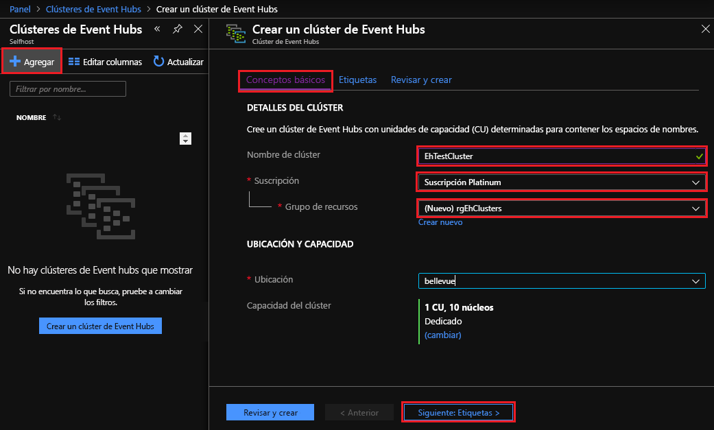](media/event-hubs-quickstart-cluster-portal/1-create-cluster-basics.png#lightbox)

5. En la pestaña  **Etiquetas**: 
   - Opcionalmente, escriba los pares de nombre/valor para las etiquetas de recursos.  
   - Seleccione el botón  **Siguiente: Revisar y crear >**   para continuar. 

   [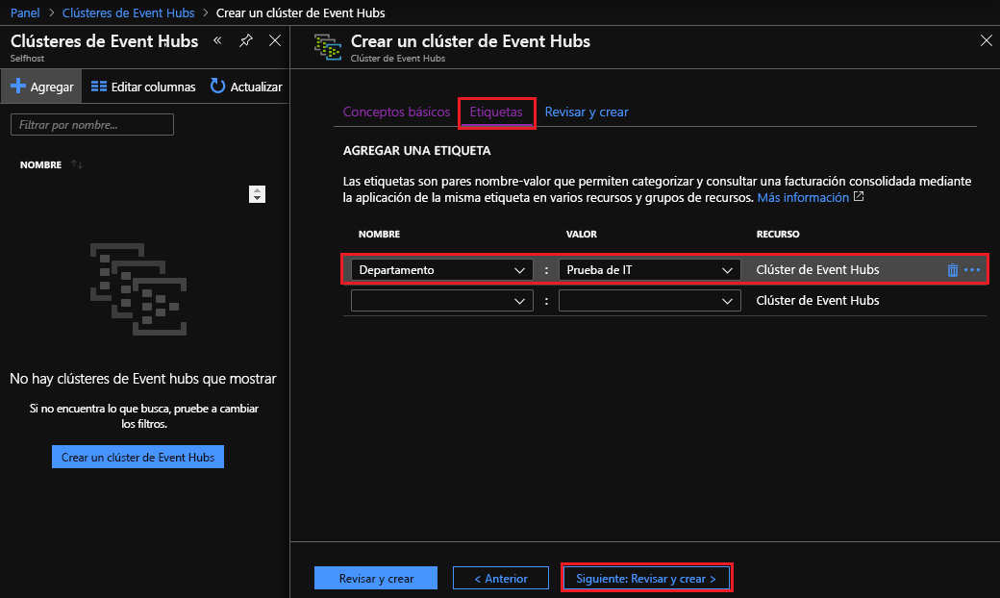](media/event-hubs-quickstart-cluster-portal/1-create-cluster-tags.png#lightbox)

6. En la pestaña  **Revisar y crear**, también verá un mensaje emergente de "validación correcta" en la parte superior de la página. Revise los detalles y, cuando esté listo para crear el clúster, seleccione  **Crear**. 

   [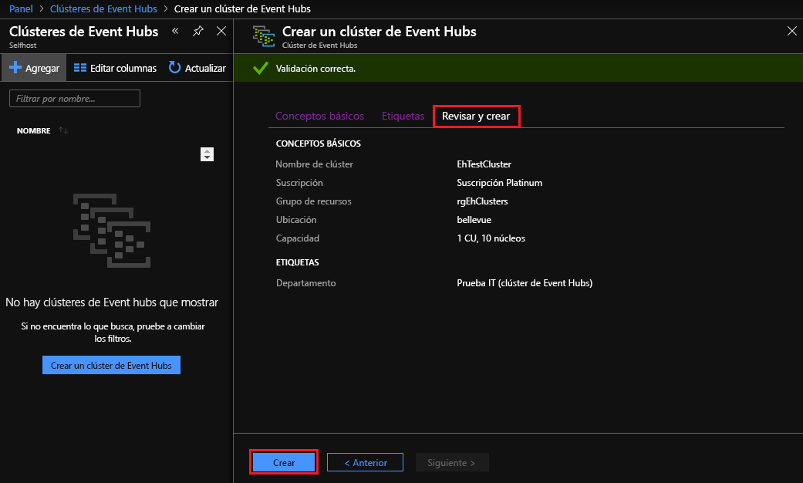](media/event-hubs-quickstart-cluster-portal/1-create-cluster-review.png#lightbox)

   >[!NOTE]
   > La implementación de un clúster de Event Hubs puede tardar varios minutos, por lo general 45 minutos como mínimo.

7. Durante la implementación, verá una página de estado **La implementación está en curso**. Una vez finalizada la implementación, la página cambia a **Se completó la implementación**. Antes de continuar con la siguiente sección, seleccione el botón **Ir al recurso** para ver el nuevo clúster.

   [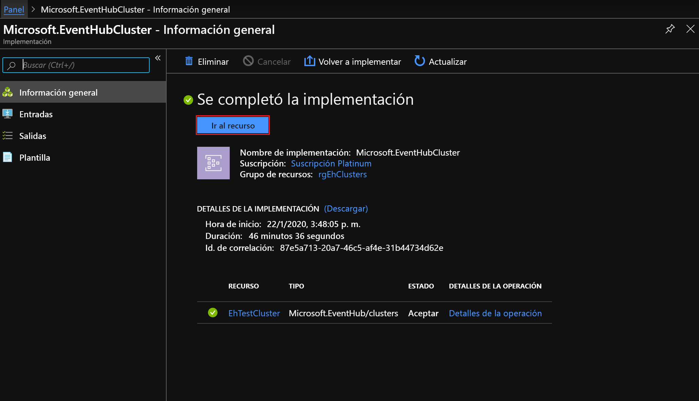](media/event-hubs-quickstart-cluster-portal/1-deployment-complete.png#lightbox)

## Creación de un espacio de nombres

Ahora se crea un espacio de nombres en el nuevo clúster:

1. En la página **Información general** de **Clúster de Event Hubs**, seleccione  **+ Espacio de nombres**  en el menú superior. 

   [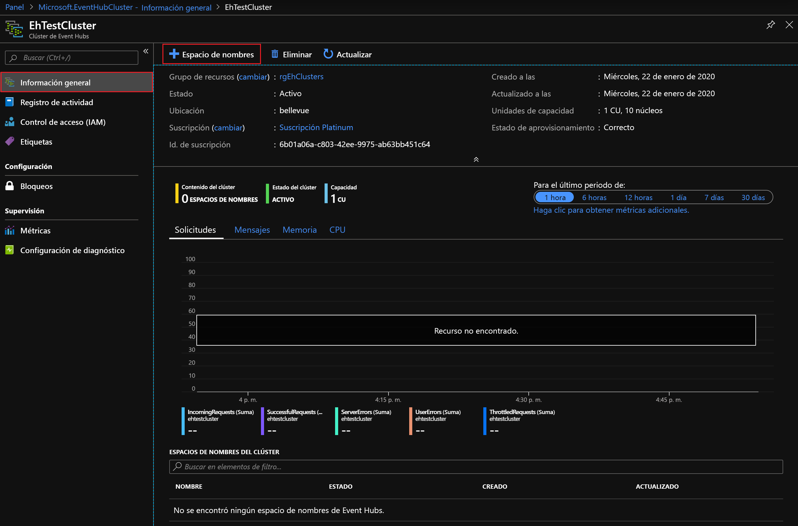](media/event-hubs-quickstart-cluster-portal/2-view-cluster.png#lightbox)

2. En el panel **Create namespace in Cluster** (Crear un espacio de nombres en el clúster), verá estas opciones:

   - **Name**: escriba un nombre para el espacio de nombres. El sistema realiza la comprobación automáticamente para ver si el nombre está disponible. En caso afirmativo, se mostrará una marca de verificación en el extremo derecho del campo. 
   - **Property/Value list** (Lista de propiedades y valores): El espacio de nombres hereda las propiedades siguientes: 
     - Id. de suscripción 
     - Resource group 
     - Location 
     - Nombre del clúster 

   - Seleccione  **Crear**  para crear el espacio de nombres:

   [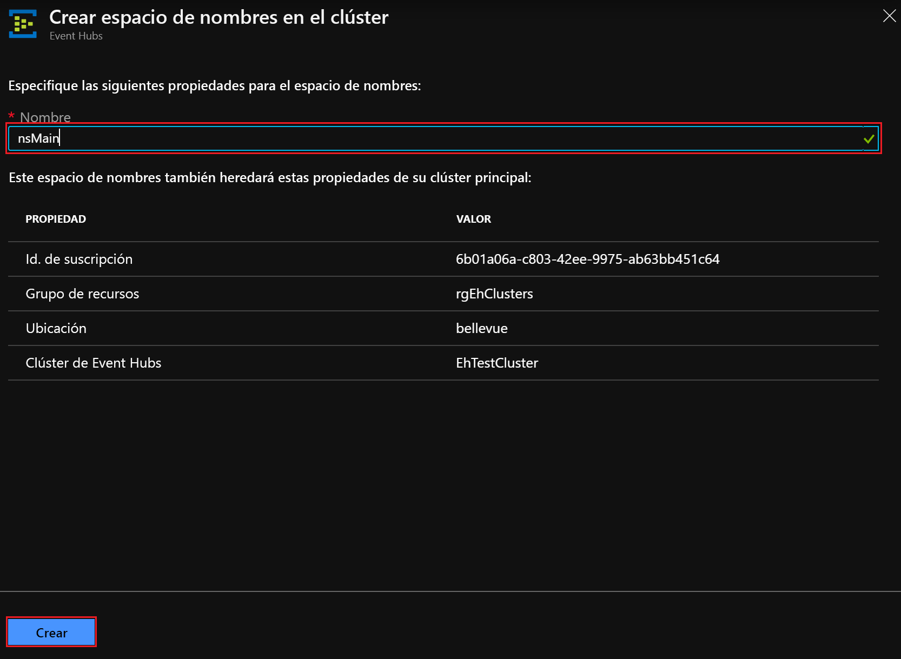](media/event-hubs-quickstart-cluster-portal/2-view-cluster-create-namespace.png#lightbox)

3. Fíjese en el nuevo espacio de nombres que aparece en **Espacios de nombres del clúster**. Antes de pasar a la siguiente sección, seleccione el vínculo para el nuevo espacio de nombres. 

   [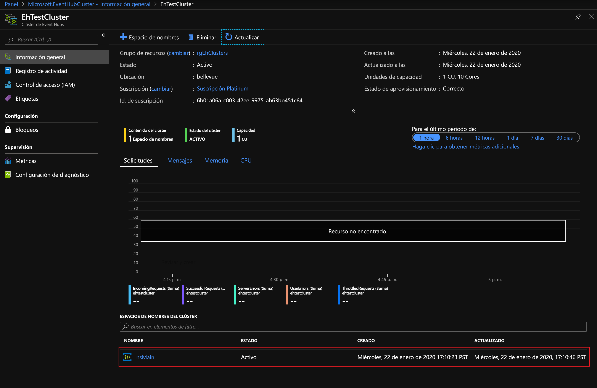](media/event-hubs-quickstart-cluster-portal/2-view-cluster-with-namespace.png#lightbox)

## Creación de un centro de eventos

1. En la página **Información general** de **Espacio de nombres de Event Hubs**, seleccione **+ Centro de eventos** en el menú superior.  

   [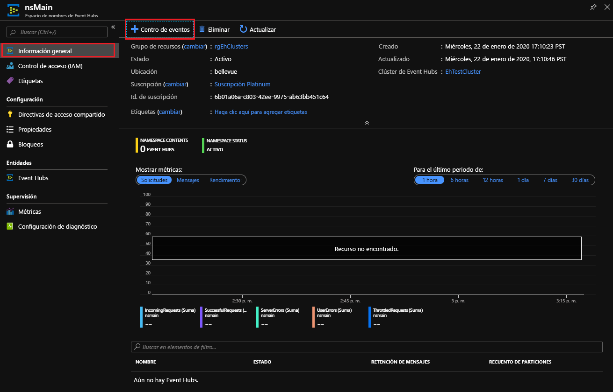](media/event-hubs-quickstart-cluster-portal/3-event-hubs-namespace-overview.png#lightbox)

2. En el panel **Crear centro de eventos**, verá estas opciones:
   - **Name**: especifique un nombre para el centro de eventos. El nombre solo puede contener letras, números, puntos, guiones y caracteres de subrayado, y debe empezar y terminar con una letra o un número. El sistema realiza la comprobación automáticamente para ver si el nombre está disponible. En caso afirmativo, se mostrará una marca de verificación en el extremo derecho del campo.
   - Seleccione  **Crear**  para crear el centro de eventos.

   [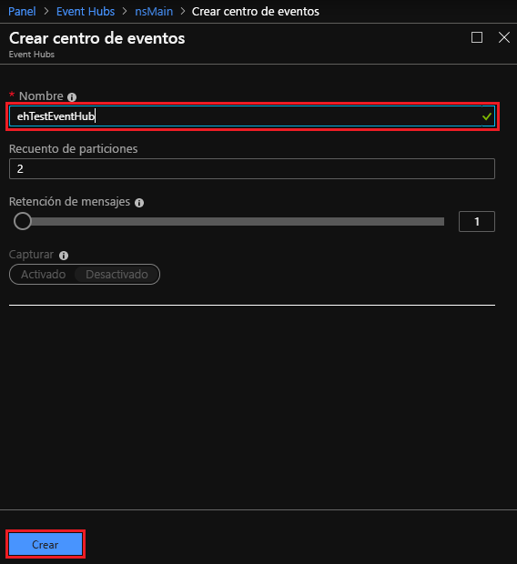](media/event-hubs-quickstart-cluster-portal/3-event-hubs-namespace-overview-create-event-hub.png#lightbox)

## Eliminación de un clúster de Event Hubs

Para eliminar el clúster:

1. Vuelva a seleccionar  **Todos los servicios**  en el panel de navegación izquierdo. Escriba "Clústeres de Event Hubs" en la barra de búsqueda y seleccione el elemento **Clústeres de Event Hubs** en la lista de resultados.
2. En la página **Clústeres de Event Hubs**, busque y seleccione el clúster que creó anteriormente.

   [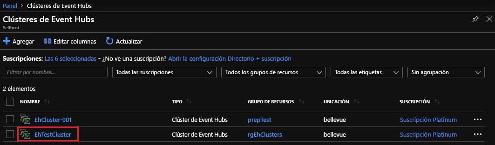](media/event-hubs-quickstart-cluster-portal/4-delete-cluster-clusters.png#lightbox)

3. En la página **Información general** de **Clúster de Event Hubs**:
   - Seleccione  **Eliminar**  en el menú superior.  
   - Se abre el panel **Eliminar clúster** a la derecha, con un mensaje de confirmación de eliminación. 
   - Escriba el nombre del clúster y seleccione  **Eliminar**  para eliminar el clúster. 

   [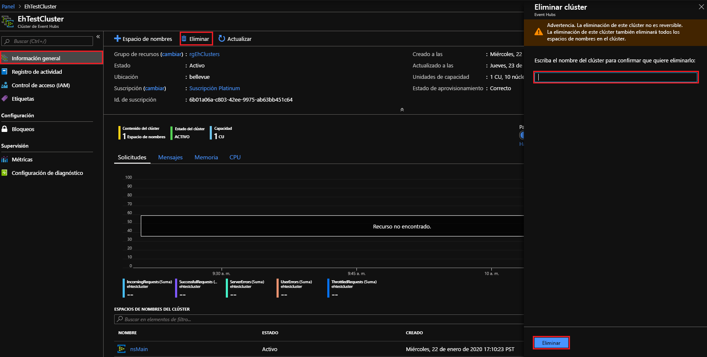](media/event-hubs-quickstart-cluster-portal/4-delete-cluster-delete.png#lightbox)

## Pasos siguientes

En este inicio rápido, ha aprendido a crear un clúster de Event Hubs mediante el portal. Ahora continúe con los inicios rápidos de "Envío y recepción de eventos", pero comience por el primero:  

> [!div class="nextstepaction"]
> [Envío y recepción de eventos desde Event Hubs](/azure/event-hubs/get-started-dotnet-standard-send-v2)
